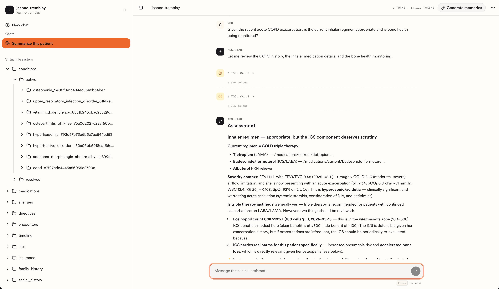

# Clinia Context Engine Studio

An open-source app you clone and run locally to explore your own [Clinia Context Engine](https://docs.clinia.com/docs/introduction) workspace through an interface: ingest patient records, browse what the engine made of them, and chat with a sample agent grounded in the result.

It's a free developer tool. Everything Studio does is already available through the Context Engine API — Studio means you don't have to build an interface first to see any of it. It doubles as the reference implementation for wiring your own app to a workspace: the REST calls, the agent, and the MCP surface are all here to read and copy.

The engine turns fragmented health records (FHIR R4 bundles, C-CDA documents, loose clinical notes) into one resolved, time-ordered patient story that agents can reason over. Studio is the window onto that — above all onto the normalization and entity resolution, which are the hardest parts to appreciate from raw API responses.

> [!IMPORTANT]
> **Studio needs a workspace. It has no clinical data of its own and no embedded engine.** Provision one in the [Clinia Console](https://console.clinia.cloud) and create API credentials — self-serve, on any tier including the free one, with no sales conversation in the way. Studio inherits whatever access those credentials have, so there's no second auth model to configure. Without them it refuses to start.

Studio is a local starting point and a tool for poking at your own data. It is not a hosted, production, or supported end-user product.



## What you can do with it

- **Ingest a patient record** — drop a folder of FHIR, CDA, or document files and watch the engine resolve entities across them.
- **Browse the virtual file system** — navigate the patient story as paths rather than as raw resources, and read each file as a **Narrative**, **Compact**, or **Structured** view.
- **Chat over the record** — ask questions answered by a tool-using Claude agent that reads the VFS over MCP and cites the files it used.
- **Keep the thread** — chats are listed per patient and reopen where you left them, backed by a local SQLite file.

## Prerequisites

| What                                          | Why                                                                                                                                                                                      |
| --------------------------------------------- | ---------------------------------------------------------------------------------------------------------------------------------------------------------------------------------------- |
| **Node.js 20.9+**                             | Required by Next.js 16. `.nvmrc` pins 24, which is what Studio is built and tested on.                                                                                                   |
| **pnpm 10+**                                  | The `packageManager` field pins the exact version; `corepack enable` will honour it.                                                                                                     |
| **A Clinia workspace**                        | Where your patient data actually lives. Created in the [Clinia Console](https://console.clinia.cloud).                                                                                   |
| **Workspace OAuth credentials, Read & Write** | Studio ingests data and creates patients, so read-only credentials will fail on those actions. See [Manage Credentials](https://docs.clinia.com/docs/console-guides/manage-credentials). |
| **An Anthropic API key**                      | The chat assistant calls Claude directly from Studio's server. Needs access to `claude-opus-4-8`.                                                                                        |

## Quickstart

```bash
git clone https://github.com/clinia/context-engine-studio.git
cd context-engine-studio
```

Create `.env.local` with your workspace and credentials:

```bash
cat > .env.local <<'EOF'
CLINIA_CONTEXT_ENGINE_API_URL=https://<workspace-id>.w.clinia.cloud
CLINIA_CONTEXT_ENGINE_OAUTH_CLIENT_ID=<your-client-id>
CLINIA_CONTEXT_ENGINE_OAUTH_CLIENT_SECRET=<your-client-secret>
ANTHROPIC_API_KEY=<your-anthropic-api-key>
EOF
```

Then install and run:

```bash
pnpm install
pnpm dev
```

Open <http://localhost:3000>. With no patients in the workspace yet, Studio sends you straight to onboarding to create your first one. The local chat database is created and migrated on first use — there is no separate migration step.

## Configuration

Every variable is read server-side; none are exposed to the browser.

### Required

| Variable                                    | Description                                                                                                                                            |
| ------------------------------------------- | ------------------------------------------------------------------------------------------------------------------------------------------------------ |
| `CLINIA_CONTEXT_ENGINE_API_URL`             | Base URL of your workspace, e.g. `https://<workspace-id>.w.clinia.cloud`. Studio derives the MCP endpoint the chat assistant uses by appending `/mcp`. |
| `CLINIA_CONTEXT_ENGINE_OAUTH_CLIENT_ID`     | OAuth client ID from the Console.                                                                                                                      |
| `CLINIA_CONTEXT_ENGINE_OAUTH_CLIENT_SECRET` | OAuth client secret. Shown once at creation and never retrievable — if lost, delete the credential and make a new one.                                 |
| `ANTHROPIC_API_KEY`                         | Anthropic API key used by the chat assistant.                                                                                                          |

Every Clinia workspace is secured, so all four variables above are required and the app fails at startup without them. Clinia's authorization server is the default; nothing else needs configuring for a hosted workspace.

### Optional

| Variable              | Default                   | Description                                                                                  |
| --------------------- | ------------------------- | -------------------------------------------------------------------------------------------- |
| `STUDIO_CHAT_DB_PATH` | `./.data/studio-chats.db` | Local SQLite file holding chat history for the sidebar and reopening. Created automatically. |

## Try it with synthetic data

If you don't have a de-identified record to hand, use **Jeanne Tremblay** — a fully synthetic 72-year-old patient with a decade of COPD-anchored history across primary care, respirology, physiotherapy, gastroenterology, radiology, and an emergency admission. Ingesting the FHIR bundle and the CDA documents together exercises cross-source entity resolution, which is the interesting part.

- [jeanne-tremblay.zip](https://docs.clinia.com/samples/jeanne-tremblay.zip) — FHIR bundle plus the C-CDA documents
- [fhir-bundle.json](https://docs.clinia.com/samples/fhir-bundle.json) — the FHIR R4 bundle alone

Unzip it and drop the folder onto the onboarding dropzone.

**Provenance.** This dataset is entirely synthetic. It describes no real person and contains no protected health information; every name, identifier, date, and clinical event in it was generated. See the [Synthetic Patient Dataset](https://docs.clinia.com/docs/workspace-guides/synthetic-patient) documentation for the full contents and timeline.

## Getting help

| You have                                        | Go here                                                                                                                                                                        |
| ----------------------------------------------- | ------------------------------------------------------------------------------------------------------------------------------------------------------------------------------ |
| A question about Studio, or an idea             | [Discussions](https://github.com/clinia/context-engine-studio/discussions)                                                                                                     |
| A bug in Studio itself                          | [Issues](https://github.com/clinia/context-engine-studio/issues)                                                                                                               |
| A fix you've already written                    | Open an [issue](https://github.com/clinia/context-engine-studio/issues) describing it — we can't merge a pull request here, but we can make the change upstream and credit you |
| A workspace, credential, ingest, or API problem | <support@clinia.com> — these are service-side and can't be diagnosed from this repository                                                                                      |

## About this repository

**The code is open. The project is not open to contributions.**

Studio is [Apache-2.0](LICENSE) licensed, and we mean that fully: read it, fork it, run it, copy patterns out of it, build a product on it. What we don't take is pull requests.

That isn't a policy so much as a description of how this repository works. It is a **read-only mirror**, published from Clinia's internal monorepo on each release and tagged with the same version as the engine and its client. The release job replaces `main` wholesale, and the branch rules admit no other writer — so a pull request opened here cannot be merged, by us or by anyone. The git history is release-grained rather than PR-grained for the same reason. See the [changelog](https://docs.clinia.com/changelog) for what changed in each version — it covers Studio and the engine together, since they release as one — and [`CONTRIBUTING.md`](CONTRIBUTING.md) for the long form of this.

None of which makes your report pointless. Bugs and questions do reach the team, and anything fixed upstream appears here in a later release. That path is open, on a best-effort basis; see [Getting help](#getting-help).
